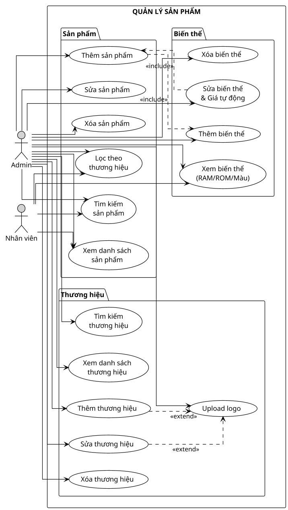
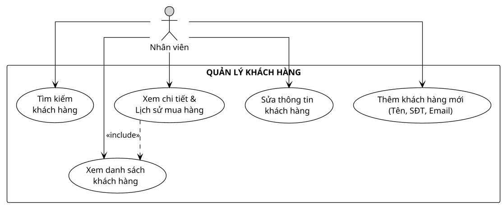
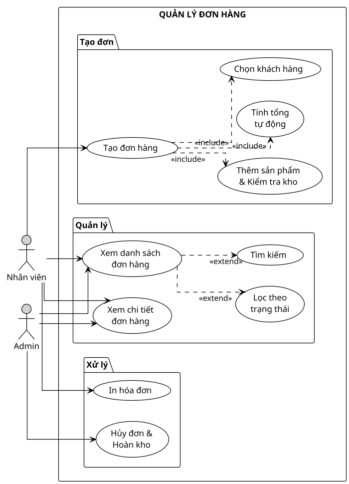
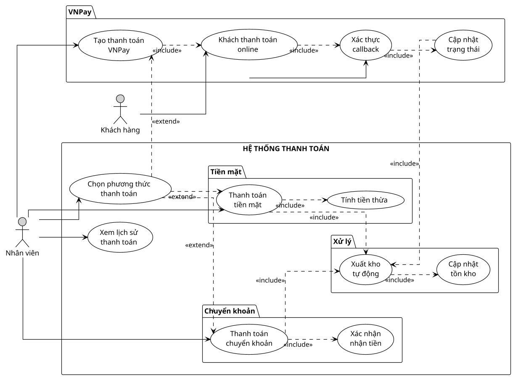
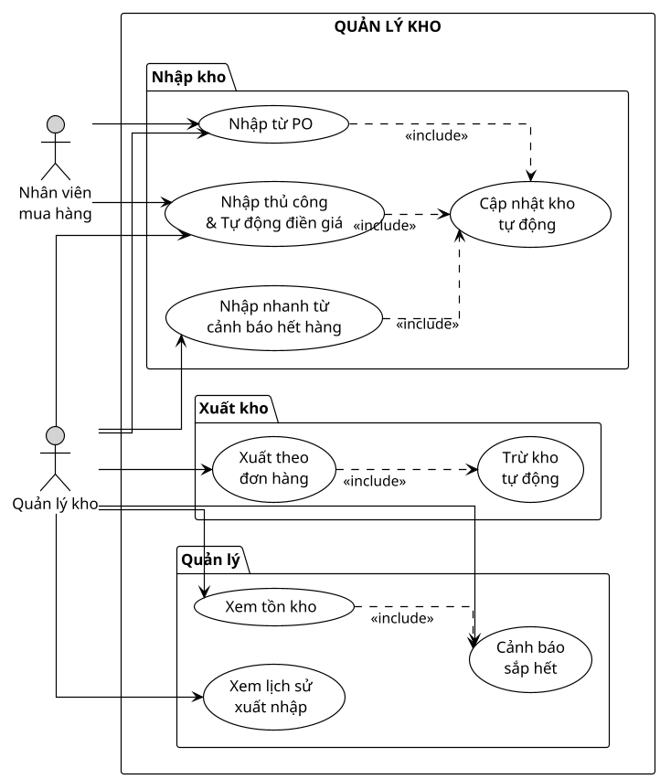
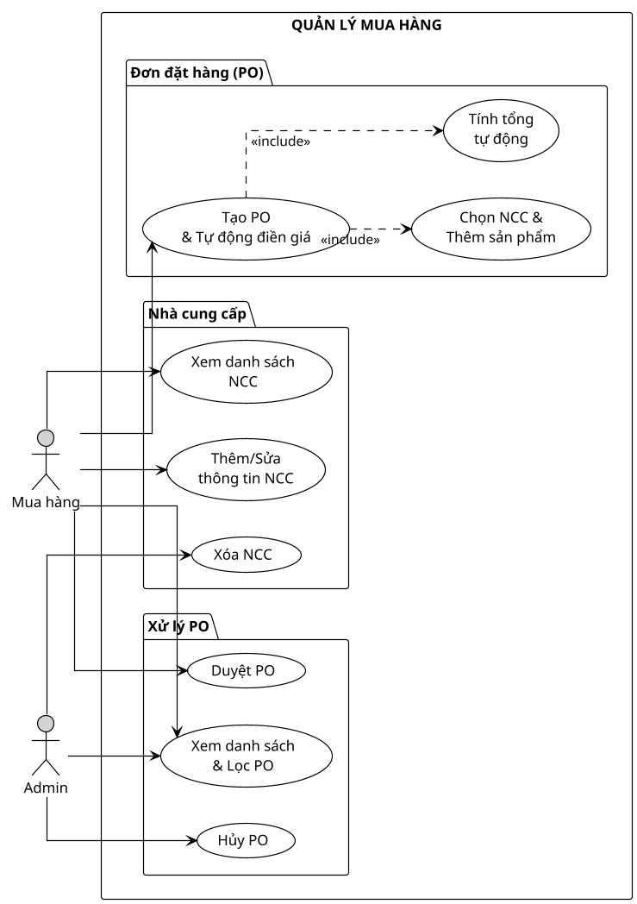
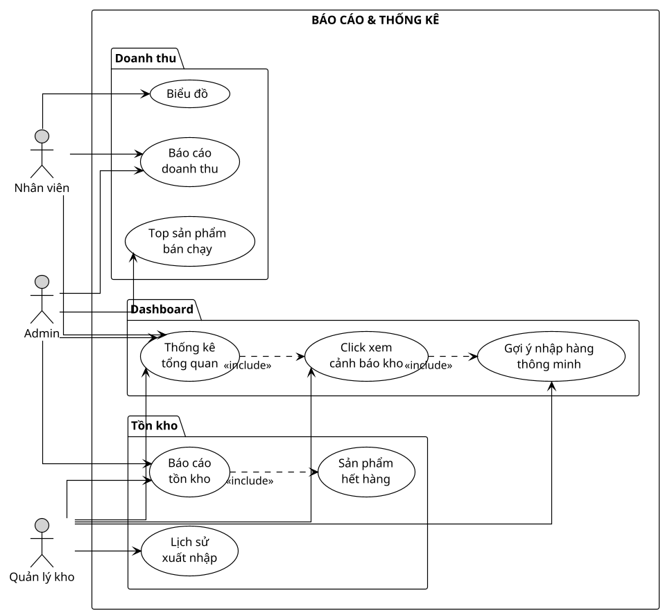
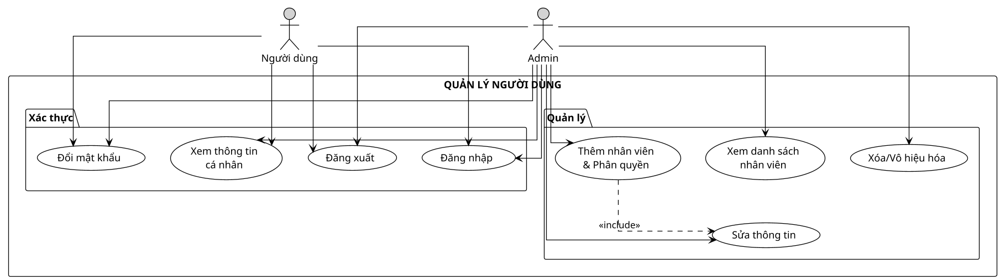

WARNING 2025-10-04 10:55:53,682 log Bad Request: /api/stock-in/
WARNING 2025-10-04 10:55:53,682 basehttp "POST /api/stock-in/ HTTP/1.1" 400 45
# Sơ đồ Use-Case Hoàn chỉnh - Hệ thống Quản lý Cửa hàng Điện thoại

## 📋 Danh sách các sơ đồ

1. Quản lý Sản phẩm
2. Quản lý Khách hàng  
3. Quản lý Đơn hàng
4. Thanh toán
5. Quản lý Kho
6. Mua hàng & Nhà cung cấp
7. Báo cáo & Thống kê
8. Quản lý Người dùng

---

## 📊 1. QUẢN LÝ SẢN PHẨM



---

## 📊 2. QUẢN LÝ KHÁCH HÀNG



---

## 📊 3. QUẢN LÝ ĐƠN HÀNG



---

## 📊 4. THANH TOÁN



---

## 📊 5. QUẢN LÝ KHO (Đã tối ưu)



---

## 📊 6. MUA HÀNG & NHÀ CUNG CẤP



---

## 📊 7. BÁO CÁO & THỐNG KÊ



---

## 📊 8. QUẢN LÝ NGƯỜI DÙNG



---

## 🎯 Tính năng đặc biệt được highlight

### ⚡ Tối ưu hóa UX:

1. **Tự động điền giá** từ hệ thống khi chọn sản phẩm
2. **Gợi ý nhập hàng thông minh** từ Dashboard
3. **Chọn nhanh** sản phẩm sắp hết → Nhập kho ngay
4. **Format số** tự động với dấu chấm (1.000.000)
5. **Validation** đầy đủ trước khi submit
6. **Tính tổng tiền** tự động
7. **Xuất/Nhập kho** tự động cập nhật

---

## 📖 Hướng dẫn render sơ đồ

### Cách 1: PlantUML Online
```
1. Truy cập: http://www.plantuml.com/plantuml/uml/
2. Copy code từ bất kỳ sơ đồ nào ở trên
3. Click "Submit"
4. Tải PNG hoặc SVG
```

### Cách 2: VS Code
```
1. Cài extension: PlantUML (jebbs.plantuml)
2. Tạo file: diagram.puml
3. Paste code
4. Alt + D để preview
5. Export: Ctrl+Shift+P → "PlantUML: Export Current Diagram"
```

### Cách 3: Command Line
```bash
# Cài PlantUML
npm install -g node-plantuml

# Render
puml generate diagram.puml -o output.png
```

---

## 📐 Kích thước đề xuất cho slide

```
Scale: 1.2 - 1.3 (vừa đủ cho slide 16:9)
Format: PNG (cho PowerPoint)
Format: SVG (cho web, vector không vỡ)
DPI: 300 (cho in ấn chất lượng cao)
```

---

## 🎨 Theme và màu sắc

```plantuml
!theme plain              # Theme đen trắng, rõ ràng
skinparam linetype ortho  # Đường thẳng góc
backgroundColor #FFFFFF   # Nền trắng
actor #LightGray         # Actor màu xám nhạt
```

---

## 📝 Ghi chú

- Tất cả sơ đồ đã được tối ưu cho **trình chiếu slide**
- **Cân đối** chiều dài và rộng
- **Màu sắc** đơn giản, dễ nhìn
- **Font chữ** rõ ràng, đủ lớn
- **Highlight** các tính năng đặc biệt (auto-fill giá, gợi ý nhập hàng)

---

**Sẵn sàng cho presentation!** 🎯

